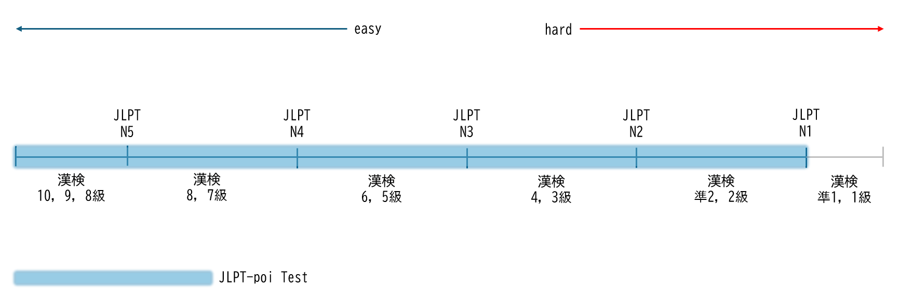

# JLPT-poi-test
J-pop과 같은 노래를 JLPT 시험지처럼 만들어보는 취미로 하는 프로젝트입니다.

## 출제 범위

## 시험지 목록

|회차|시험지 링크|문제 수|
|------|------------|---------|
|1|[Test 1](./test/JLPT-poi%20Test%201.pdf)|65문제|
|2|[Test 2](./test/JLPT-poi%20Test%202.pdf)|30문제|
|3|[Test 2](./test/JLPT-poi%20Test%203.pdf)|22문제|
